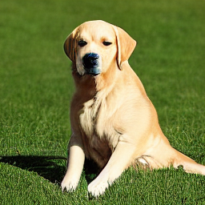
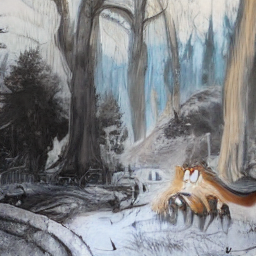
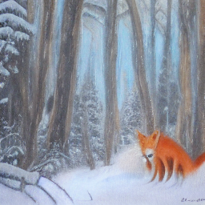
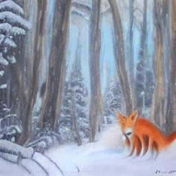
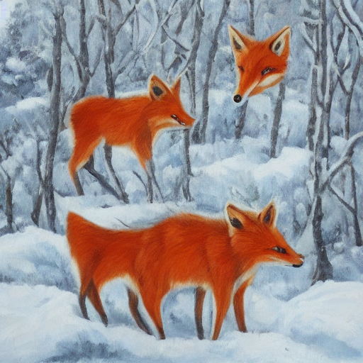

# Latent Diffusion Models in PyTorch

An inference-only implementation of [Latent Diffusion Models](https://arxiv.org/abs/2112.10752) for learning how text-to-image generation works. It uses the authors' [pretrained 256×256 checkpoint](https://huggingface.co/CompVis/ldm-text2im-large-256), while defining the text encoder, conditional U-Net, KL autoencoder, and DDIM sampler locally in PyTorch.

[中文：论文与推理流程](README.zh-CN.md)

---

## Example Output

| Snowy forest fox | Sunflowers in a vase | Golden retriever on grass |
| :---: | :---: | :---: |
| <br><em>“A red fox in a snowy forest, oil painting”</em> | <br><em>“A sunflower in a blue vase, oil painting”</em> | <br><em>“A golden retriever sitting on grass, photograph”</em> |

All three examples use the pretrained 256×256 checkpoint with 50 DDIM steps, guidance `5`, eta `0`, and seed `42`.

---

## Quick Start

### Generate with defaults

```bash
python generate.py
```

### Provide a prompt and output path

```bash
python generate.py --prompt "A red fox in a snowy forest, oil painting" --output outputs/lighthouse.png
```

---

## Key Parameter Comparisons

### Guidance strength (`--guidance`)

| `1` — conditioned only | `5` — default CFG | `10` — stronger CFG |
| :---: | :---: | :---: |
|  |  |  |
| Prompt prediction alone | Balanced text influence | Stronger influence |

### DDIM steps (`--steps`)

| `20` steps | `50` steps — default | `100` steps |
| :---: | :---: | :---: |
|  |  |  |
| Faster, fewer updates | Default balance | Slower |

### DDIM randomness (`--eta`)

| `0` — default | `1` — added DDIM noise |
| :---: | :---: |
|  |  |
| No extra noise during updates | Different sampling trajectory |

### Seed (`--seed`)

| `42` — default | `123` |
| :---: | :---: |
|  |  |

### Image size (`--width`, `--height`)

| `256×256` — training size | `512×512` — larger canvas |
| :---: | :---: |
|  |  |

---

## Installation

1. Create and activate a Python environment (or use an existing one):

   ```bash
   conda create -n diffusion python=3.12 -y
   conda activate diffusion
   ```

2. Install a [PyTorch build for your platform](https://pytorch.org/get-started/locally/), then install the remaining packages:

   ```bash
   python -m pip install -r requirements.txt
   ```

3. Download the pinned checkpoint:

   ```bash
   python -m scripts.download_model
   ```

The weights total approximately 5.73 GiB. The default downloader uses `curl` and checks for at least 13 GiB of free disk space while assembling files. If `curl` is unavailable, use `python -m scripts.download_model --transport hub`. Once downloaded, generation runs offline.

---

## Complete CLI Options

### Prompt and sampling

| Option | Default | Meaning and allowed values |
| :--- | :---: | :--- |
| `--prompt` | `A red fox in a snowy forest, oil painting` | Non-empty text description. The tokenizer pads or truncates it to 77 tokens. |
| `--steps` | `50` | Number of DDIM updates; integer from `1` to `999`. More steps require more U-Net calls. |
| `--guidance` | `5.0` | Non-negative finite CFG scale. `1` runs only the conditioned branch; `0` uses the empty-prompt prediction. |
| `--eta` | `0.0` | DDIM noise scale from `0` to `1`. `0` adds no noise during updates. |
| `--seed` | `42` | Random seed from `0` (inclusive) to `2^63` (exclusive). Controls the initial noise and any noise added when eta is positive. |

### Image and output

| Option | Default | Meaning and allowed values |
| :--- | :---: | :--- |
| `--width` | `256` | Output width in pixels; at least `64` and a multiple of `64`. |
| `--height` | `256` | Output height in pixels; at least `64` and a multiple of `64`. |
| `--output` | `outputs/<timestamp>-seed<seed>.png` | PNG path. Parent folders are created; existing files are not overwritten. |

### Hardware and precision

| Option | Default | Meaning and allowed values |
| :--- | :---: | :--- |
| `--device` | `auto` | `auto`, `cpu`, `mps`, `cuda`, or a numbered GPU such as `cuda:1`. `auto` prefers CUDA, then MPS, then CPU. |
| `--dtype` | `auto` | `auto`, `float16`, `bfloat16`, or `float32`. Auto selects float16 on CUDA/MPS and float32 on CPU. CPU supports only float32; MPS does not support bfloat16; CUDA bfloat16 requires a compatible GPU. |
| `-h`, `--help` | — | Show the command-line help. |

The checkpoint downloader, [`scripts/download_model.py`](scripts/download_model.py), also accepts:

| Option | Default | Meaning and allowed values |
| :--- | :---: | :--- |
| `--transport` | `chunks` | `chunks` (resumable ranged downloads), `curl` (whole files), or `hub` (Hugging Face Hub). |
| `--workers` | `8` | Number of concurrent connections for `chunks`; integer from `1` to `16`. Other transports use their own fixed worker counts. |

---

## Project Structure

```text
.
├── generate.py             # Text-to-image inference entry point
├── requirements.txt        # Runtime dependencies (install PyTorch separately)
├── models/
│   ├── bert.py             # Text encoder
│   ├── unet.py             # Conditional noise predictor and skip connections
│   ├── layers.py           # ResNet, attention, and shared layers
│   ├── scheduler.py        # DDIM time steps and update equations
│   ├── autoencoder.py      # KL image encoder and decoder
│   ├── loader.py           # Strict loading of pretrained weights
│   └── config.py           # Checkpoint paths and shared configuration
├── scripts/
│   └── download_model.py  # Download and verify pretrained files
└── utils/
    ├── cli.py             # CLI options and input validation
    ├── environment.py     # Device and precision selection
    ├── runtime.py         # Environment setup before importing PyTorch
    └── output.py          # PNG output path and saving
```

---

## References

- [High-Resolution Image Synthesis with Latent Diffusion Models](https://arxiv.org/abs/2112.10752)
- [Denoising Diffusion Implicit Models](https://arxiv.org/abs/2010.02502)
- [CompVis `ldm-text2im-large-256` checkpoint](https://huggingface.co/CompVis/ldm-text2im-large-256)
