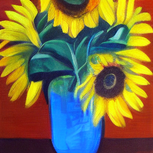
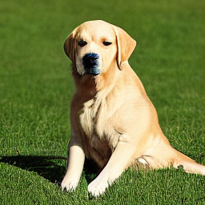
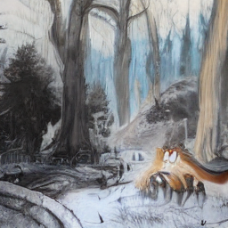
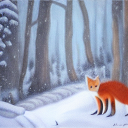
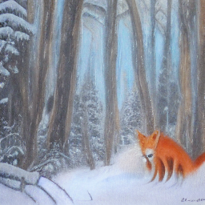
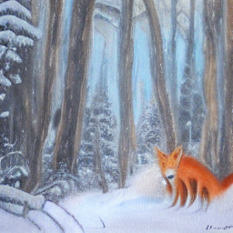
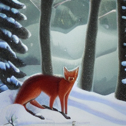
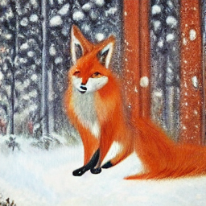
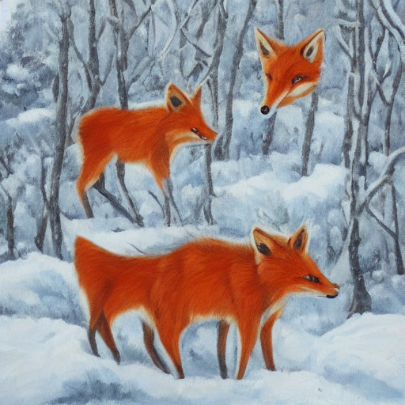

# Latent Diffusion Models (LDM) [](https://impasto-lab.github.io/Latent-Diffusion/examples/ldm-pipeline.html)

This is an inference-only PyTorch implementation of **High-Resolution Image Synthesis with Latent Diffusion Models** by Rombach et al. (CVPR 2022). It shows how text-to-image generation works.

Generation has three steps:

1. The text encoder (LDMBert) converts the prompt into 77 feature vectors of size 1280.
2. The conditional U-Net predicts the noise in a random latent of size `4 × H/8 × W/8`. The DDIM sampler removes this noise step by step, with classifier-free guidance.
3. The KL autoencoder decodes the final latent into an image.

The code loads the authors' [pretrained 256×256 checkpoint](https://huggingface.co/CompVis/ldm-text2im-large-256). The text encoder, U-Net, autoencoder and DDIM sampler are defined in this repository. You can change the number of steps, the guidance scale, the noise amount, the seed and the image size at test time without retraining.

[中文：论文与推理流程](README.zh-CN.md)

---

## Examples

All three examples use the pretrained 256×256 checkpoint, 50 DDIM steps, guidance `5`, eta `0` and seed `42`.

<div align="center">
<table>
  <tr>
    <th width="33%">Snowy forest fox</th>
    <th width="33%">Sunflowers in a vase</th>
    <th width="33%">Golden retriever on grass</th>
  </tr>
  <tr>
    <td align="center"><br><sub><em>“A red fox in a snowy forest, oil painting”</em></sub></td>
    <td align="center"><br><sub><em>“A sunflower in a blue vase, oil painting”</em></sub></td>
    <td align="center"><br><sub><em>“A golden retriever sitting on grass, photograph”</em></sub></td>
  </tr>
</table>
</div>

---

## Installation

1. Create and activate a Python environment, or use an existing one:

   ```bash
   conda create -n diffusion python=3.12 -y
   conda activate diffusion
   ```

2. Install a [PyTorch build for your platform](https://pytorch.org/get-started/locally/). Choose the CUDA build for an NVIDIA GPU. `requirements.txt` does not list `torch`, so this step must come first. Then install the other packages:

   ```bash
   python -m pip install -r requirements.txt
   ```

3. Download the pinned checkpoint (about 5.73 GiB). The command needs `curl`; if `curl` is missing, use `--transport hub` (see [Options](#options)). Run the same command again to resume an interrupted download:

   ```bash
   python -m scripts.download_model
   ```

---

## Usage

Generate an image with the default prompt:

```bash
python generate.py
```

Set the prompt and the output path:

```bash
python generate.py --prompt "A red fox in a snowy forest, oil painting" --output outputs/fox.png
```

Without `--output`, the image goes to `outputs/<timestamp>-seed<seed>.png`.

The tables below change one option and keep the other options at their defaults. All images use the default prompt.

### Guidance scale (`--guidance`)

<div align="center">
<table>
  <tr>
    <th width="33%"><code>1</code></th>
    <th width="33%"><code>5</code> (default)</th>
    <th width="33%"><code>10</code></th>
  </tr>
  <tr>
    <td align="center"><br><sub>Prompt prediction only</sub></td>
    <td align="center"><br><sub>Default</sub></td>
    <td align="center"><br><sub>Larger scale</sub></td>
  </tr>
</table>
</div>

### DDIM steps (`--steps`)

<div align="center">
<table>
  <tr>
    <th width="33%"><code>20</code></th>
    <th width="33%"><code>50</code> (default)</th>
    <th width="33%"><code>100</code></th>
  </tr>
  <tr>
    <td align="center"><br><sub>20 U-Net calls</sub></td>
    <td align="center"><br><sub>50 U-Net calls</sub></td>
    <td align="center"><br><sub>100 U-Net calls</sub></td>
  </tr>
</table>
</div>

### DDIM noise (`--eta`)

<div align="center">
<table>
  <tr>
    <th width="50%"><code>0</code> (default)</th>
    <th width="50%"><code>1</code></th>
  </tr>
  <tr>
    <td align="center"><br><sub>No new noise in each step</sub></td>
    <td align="center"><br><sub>DDPM-like noise in each step</sub></td>
  </tr>
</table>
</div>

### Seed (`--seed`)

<div align="center">
<table>
  <tr>
    <th width="50%"><code>42</code> (default)</th>
    <th width="50%"><code>123</code></th>
  </tr>
  <tr>
    <td align="center"><br><sub>Default start noise</sub></td>
    <td align="center"><br><sub>Different start noise</sub></td>
  </tr>
</table>
</div>

### Image size (`--width`, `--height`)

<div align="center">
<table>
  <tr>
    <th width="50%"><code>256</code> &times; <code>256</code> (default)</th>
    <th width="50%"><code>512</code> &times; <code>512</code></th>
  </tr>
  <tr>
    <td align="center"><br><sub>Training size</sub></td>
    <td align="center"><br><sub>Larger size</sub></td>
  </tr>
</table>
</div>

### Tips

- Write the prompt in English. The text encoder was trained on English captions only.
- The tokenizer keeps 77 tokens, so the model ignores the end of a long prompt.
- Start with `--guidance 5`. At `1`, the sampler runs without guidance and the prompt has a weaker effect.
- Use `--steps 20` for a fast preview. In the images above, `20` and `50` steps give similar results.
- Change `--seed` to get a different image from the same prompt.
- Keep the default size `256×256`. The checkpoint was trained at this size, and the `512×512` example shows three foxes instead of one.

---

## Options

| Argument | Type | Default | Description |
|:---:|:---:|:---:|:---:|
| `--prompt` | string | `A red fox in a snowy forest, oil painting` | Text prompt. An empty prompt gives an unconditional sample. The tokenizer pads or truncates the prompt to 77 tokens. |
| `--steps` | integer | `50` | Number of DDIM steps, from `1` to `999`. Each step calls the U-Net once. |
| `--guidance` | float | `5.0` | Classifier-free guidance scale. `1` runs only the prompt branch. `0` uses the prediction for the empty prompt. |
| `--eta` | float | `0.0` | DDIM noise scale, normally from `0` to `1`. `0` adds no noise in the steps. `1` is similar to DDPM. |
| `--seed` | integer | `42` | Random seed for the start noise and for the noise added when `--eta` is above `0`. |
| `--width` | integer | `256` | Image width in pixels. The value must be at least `64` and a multiple of `64`. |
| `--height` | integer | `256` | Image height in pixels. The value must be at least `64` and a multiple of `64`. |
| `--device` | string | `auto` | `auto`, `cpu`, `mps`, `cuda`, or a numbered GPU such as `cuda:1`. `auto` selects CUDA first, then MPS, then CPU. |
| `--dtype` | string | `auto` | `auto`, `float16`, `bfloat16` or `float32`. `auto` selects `float16` on CUDA and MPS, and `float32` on CPU. Your PyTorch build may not support half precision on CPU or `bfloat16` on MPS. |
| `--output` | path | `outputs/<timestamp>-seed<seed>.png` | Path of the PNG file. The command creates the parent folders and overwrites an existing file. |
| `-h`, `--help` | flag | - | Show the help message. |

The defaults give the settings of all example images in this README.

The checkpoint downloader, [`scripts/download_model.py`](scripts/download_model.py), has two more options:

| Argument | Type | Default | Description |
|:---:|:---:|:---:|:---:|
| `--transport` | string | `curl` | `curl` downloads whole files and can resume. `chunks` downloads byte ranges; use it behind a proxy that cuts long connections. `hub` uses the Hugging Face Hub. |
| `--workers` | integer | `8` | Number of parallel files (`curl`, `hub`) or byte ranges (`chunks`), from `1` to `16`. |
| `-h`, `--help` | flag | - | Show the help message. |

---

## Project Structure

```text
.
├── examples/
│   ├── comparisons/            # Images for the option comparisons
│   ├── ldm-pipeline.html       # Pipeline animation (in Chinese)
│   └── *.png                   # Example images
├── models/
│   ├── bert.py                 # Text encoder (LDMBert)
│   ├── unet.py                 # Conditional U-Net: time embedding, text cross-attention, skip connections
│   ├── autoencoder.py          # KL autoencoder (encoder and decoder)
│   ├── scheduler.py            # DDIM time steps and update equations
│   ├── layers.py               # ResNet block, resampling layers, shared attention function
│   ├── loader.py               # Config reader and strict weight loader
│   ├── config.py               # Checkpoint paths and constants
│   ├── model_manifest.json     # File sizes and hashes of the checkpoint
│   └── ldm-text2im-large-256/  # Downloaded checkpoint (not in Git)
├── outputs/                    # Generated images (not in Git)
├── scripts/
│   └── download_model.py       # Downloader and file check for the checkpoint
├── generate.py                 # Full pipeline: text encoder, DDIM loop, decoder, PNG
├── requirements.txt            # Python packages (install PyTorch separately)
├── dl-animation-guide.md       # Notes on building the pipeline animation (in Chinese)
├── README.zh-CN.md             # Chinese notes on the paper and the inference steps
└── LICENSE                     # MIT License
```

---

## Reference

- Rombach, R., Blattmann, A., Lorenz, D., Esser, P., Ommer, B. *High-Resolution Image Synthesis with Latent Diffusion Models*. CVPR 2022. [Paper](https://arxiv.org/abs/2112.10752)
- Song, J., Meng, C., Ermon, S. *Denoising Diffusion Implicit Models*. ICLR 2021. [Paper](https://arxiv.org/abs/2010.02502)
- [CompVis `ldm-text2im-large-256` checkpoint](https://huggingface.co/CompVis/ldm-text2im-large-256)

---

## License

This project uses the [MIT License](LICENSE).
